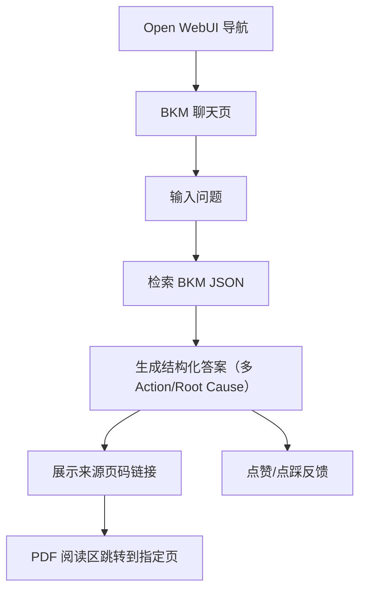

## 1. Product Overview
在 Open WebUI 内集成“BKM 聊天机器人”（集成方式参考 KPI Bot）。
基于你提供的 BKM PDF 对应 JSON 数据进行问答，输出多个 action/root cause，并支持点赞点踩与来源 PDF 页数跳转。

## 2. Core Features

### 2.1 Feature Module
本需求由以下页面构成：
1. **BKM 聊天页**：对话输入与历史、结构化答案（多组 action/root cause）、来源引用与 PDF 页跳转、点赞点踩。

### 2.3 Page Details
| Page Name | Module Name | Feature description |
|---|---|---|
| BKM 聊天页 | 机器人入口与会话 | 进入 BKM Bot 专属页面并展示欢迎语；在单页内保留本次会话的消息列表与滚动定位。 |
| BKM 聊天页 | 问答输入 | 输入问题并发送；展示加载态与错误态（例如“未找到匹配内容/数据缺失”）。 |
| BKM 聊天页 | 检索与答案生成 | 根据用户问题从 BKM JSON 中检索多个相关条目；生成结构化回答：按“条目/案例”列出多组 **Action** 与 **Root Cause**（允许 1:N），并给出简短总结。 |
| BKM 聊天页 | 来源引用与页码跳转 | 在每个条目下展示来源信息（PDF 文件名 + 页码）；点击后打开/聚焦右侧 PDF 阅读区并跳转到对应页码。 |
| BKM 聊天页 | 反馈（点赞/点踩） | 对每条机器人回复提供点赞/点踩；可选填写原因/备注；提交后提示成功并在 UI 上反映状态。 |
| BKM 聊天页 | 结果呈现规范 | 对答案以卡片/列表呈现：标题（匹配主题）、Action/Root Cause 字段、证据摘录（来自 JSON）、来源页码链接；支持复制答案文本。 |

## 3. Core Process
你在 Open WebUI 进入 BKM 聊天页后，输入问题（例如某问题的处置动作与根因）。系统会从 BKM JSON 中检索最相关的多个条目，将其整理为多组 action/root cause 并生成自然语言总结；每组结论都带有来源 PDF 页码。你可以点击页码在右侧 PDF 阅读区直接跳转验证；并对本条回答进行点赞或点踩，反馈会被记录用于后续改进。

