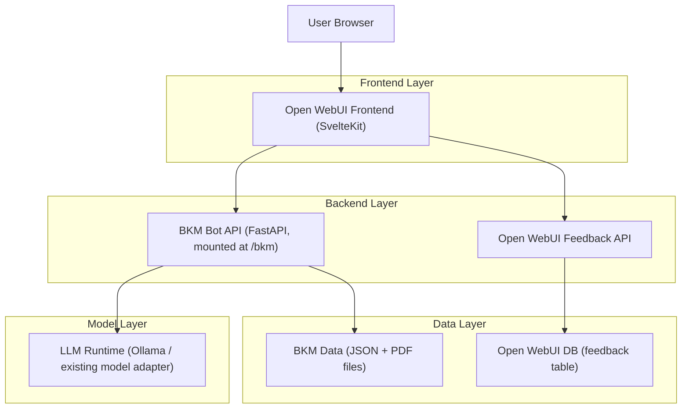
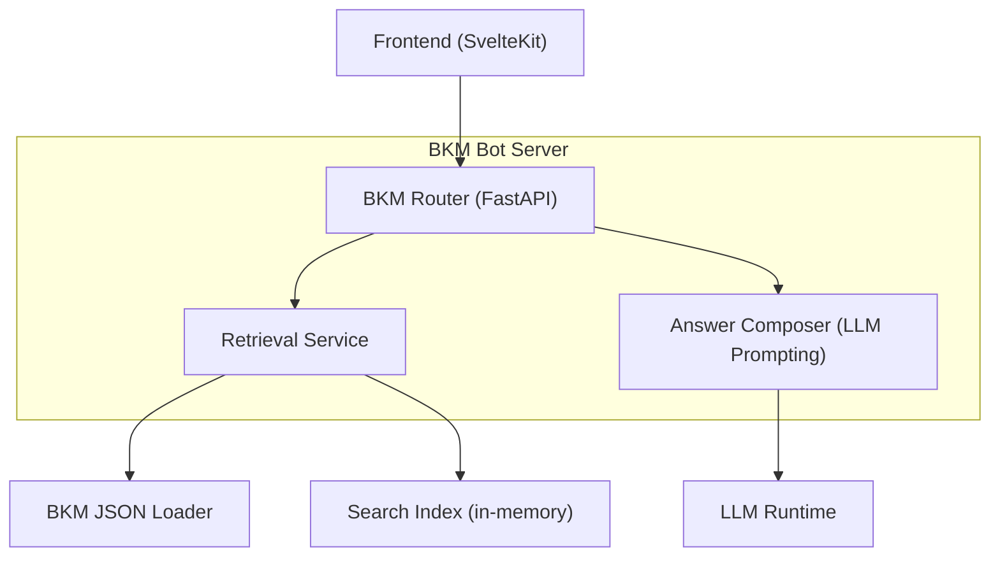
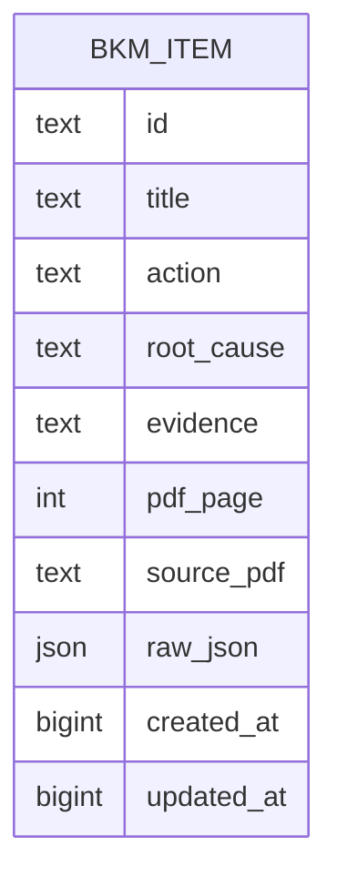

## 1.Architecture design


## 2.Technology Description
- Frontend: SvelteKit + TypeScript（复用 Open WebUI UI 体系）
- Backend: FastAPI（参考 KPI Bot 的 Bottun 应用挂载方式）
- Data: 本地文件（bkm.json + bkm.pdf）；反馈复用 Open WebUI 内置 DB
- LLM: 复用现有本地模型运行方式（例如通过 Ollama；与 KPI Bot 的 AIService 类似）

## 3.Route definitions
| Route | Purpose |
|---|---|
| /bkm | BKM 聊天页（专用 UI，含来源阅读区与反馈） |
| /bkm/v1/chat/completions | OpenAI 兼容对话接口（便于按“模型”方式接入/复用现有调用方式） |
| /bkm/chat/search | （内部）对 BKM JSON 做检索并返回候选条目（含 action/root cause/page） |
| /bkm/assets/bkm.pdf | 提供 BKM PDF 静态访问，用于“#page=”跳转 |
| /api/feedback | 复用 Open WebUI 反馈接口，记录点赞点踩（meta 里带 chat_id/message_id） |

## 4.API definitions (If it includes backend services)
### 4.1 Core API
BKM 问答（OpenAI 兼容）
```
POST /bkm/v1/chat/completions
```
Request:
| Param Name| Param Type | isRequired | Description |
|---|---|---|---|
| model | string | true | 固定为 bkm-bot（或类似命名） |
| messages | {role:string, content:string}[] | true | OpenAI messages，取最后一条 user 作为问题 |
| stream | boolean | false | 是否流式返回 |

Response（核心字段约定，允许 extra）：
| Param Name| Param Type | Description |
|---|---|---|
| choices[0].message.content | string | Markdown 文本，包含多组 Action/Root Cause 与来源页码链接 |
| choices[0].message.meta | object | 结构化元信息（用于 UI 渲染），如 matched_items、pdf_page_refs |

BKM 检索（内部，便于调试/复用）
```
POST /bkm/chat/search
```
Request:
| Param Name| Param Type | isRequired | Description |
|---|---|---|---|
| query | string | true | 用户问题 |
| top_k | number | false | 返回条目数量，默认 5 |

Response:
| Param Name| Param Type | Description |
|---|---|---|
| items | array | 候选条目列表（action/root_cause/evidence/page 等） |

## 5.Server architecture diagram (If it includes backend services)


## 6.Data model(if applicable)
### 6.1 Data model definition
（可选：若希望支持增量更新/在线管理，可将 JSON 条目落库；否则可直接文件加载，不建表。）



### 6.2 Data Definition Language
BKM 条目表（bkm_items，可选）
```
CREATE TABLE bkm_items (
  id TEXT PRIMARY KEY,
  title TEXT,
  action TEXT,
  root_cause TEXT,
  evidence TEXT,
  pdf_page INTEGER,
  source_pdf TEXT,
  raw_json JSON,
  created_at BIGINT,
  updated_at BIGINT
);

CREATE INDEX idx_bkm_items_pdf_page ON bkm_items(pdf_page);
```